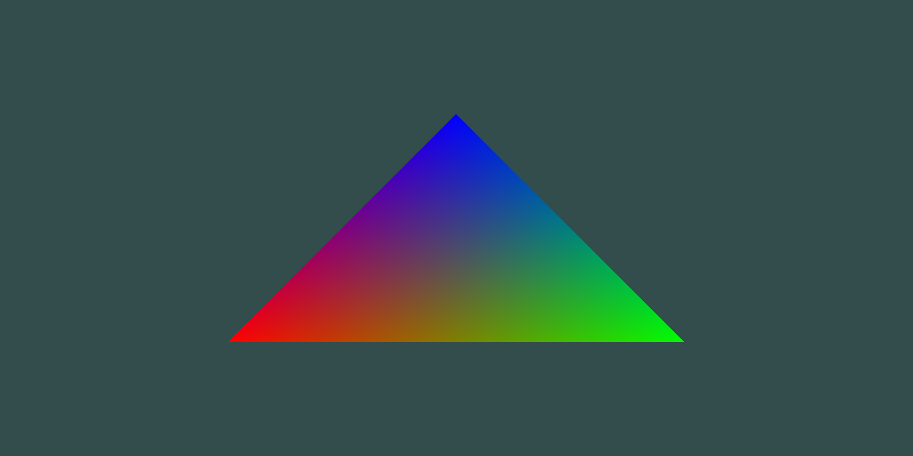
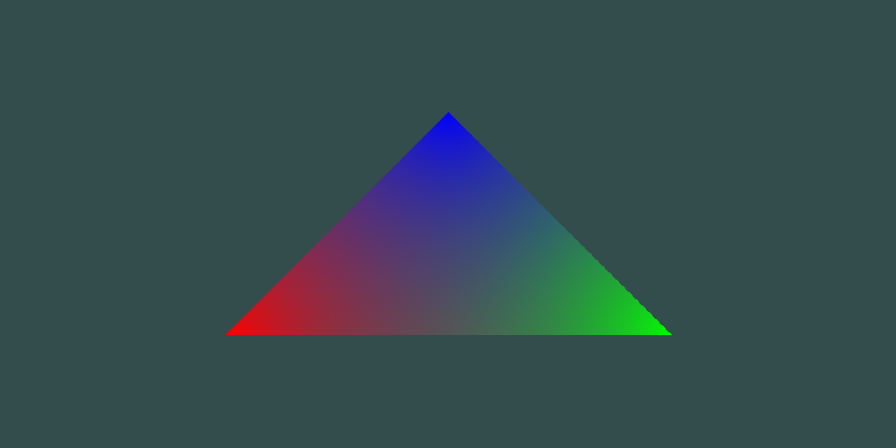

# Triangle_drawing
Triangle drawing test with CPU, GPU(OpenGL), GPU(CUDA) 

Interpolation and triangle checking method are can be defferent between OpenGL and others

## From OpenGL

## From CPU

## From CUDA

